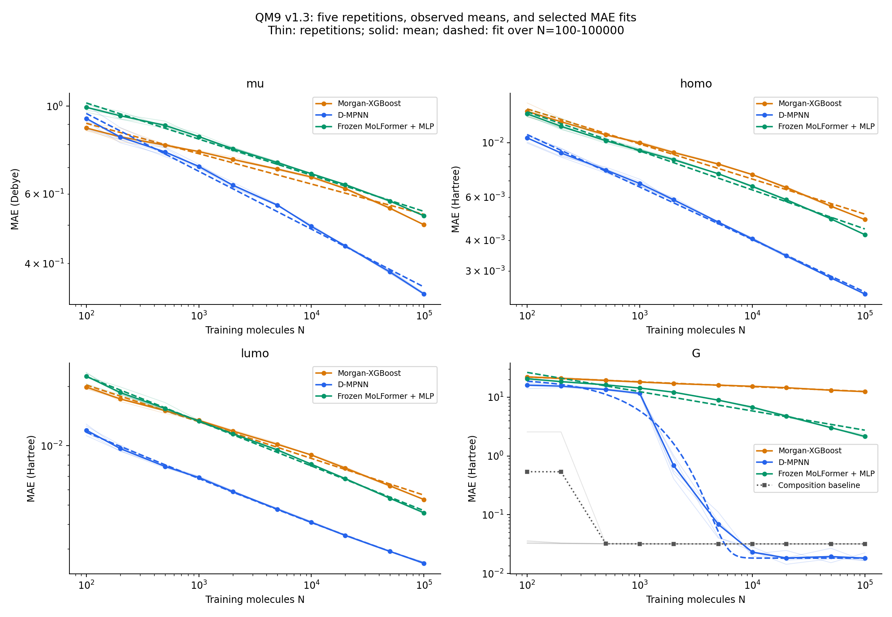
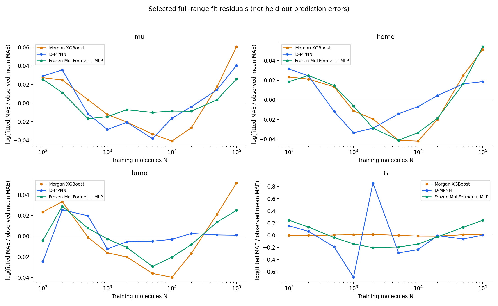
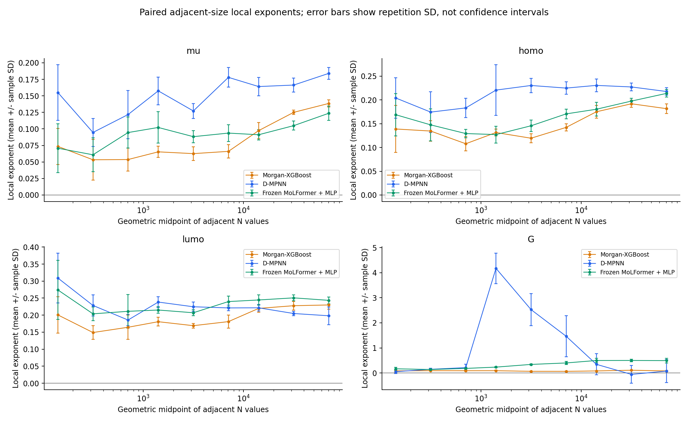

# QM9 scaling v1.3：数据规模定律、适用范围与预测收益

日期：2026-09-11。执行版本：`v1.3-exec-v4`。研究目录：`studies/scaling-law-v1.3-exec-v4`。

本报告依据已完成的核心矩阵重写，以寻找和检验 scaling law 为主线，而非以训练完工或模型排名为主线。没有新增训练、重新选参、重新拟合或改写原实验产物；图表从已有结果生成。原工程完工记录保留在附录A，与本次研究解释区分。

发布范围：本次提交包含报告、配图、图表来源哈希及作图脚本，不包含服务器上尚未提交的v1.3训练系统改动或原始实验产物。下文`studies/...`为服务器仓库内路径，并非已上传文件；运行作图脚本需要服务器上的v1.3代码和对应产物。研究方案链接指向仓库文件，不表示其远端版本已同步到本次实验冻结版本。

## 摘要：目前找到了什么规律

在固定QM9二维输入、划分和开发协议下，三条路线、四个性质的12条平均MAE学习曲线中，10条在预定候选比较中选择普通幂律：

\[
E_{m,t}(N\mid P)=A_{m,t}\left(\frac{N}{1000}\right)^{-\alpha_{m,t}}.
\]

这里的共性是函数形式，不是所有路线和性质共享一个指数。非G目标的全区间获选模型按规模留一平均绝对log误差为0.0156—0.0348；D-MPNN/lumo偏好带平台幂律，但在预设500—100k区间又选择普通幂律。G揭示两类边界：MoLFormer-MLP虽选择幂律，却有明显区间依赖和系统残差；D-MPNN更偏好带平台指数，且存在预算触顶和参数触边，不能解释为已经验证的收敛定律。

因此，当前成果是**具有路线/性质依赖参数、限定于本协议和观测范围的数据规模经验律及其适用性证据**。它不是普适物理定律、共享指数结论或独立大规模盲测成功的证明。多数曲线选中某函数，不等于每条曲线都已通过充分的定律验证。

## 1. 研究问题与证据口径

依据[原研究方案](../docs/SCALING_LAW_EXPERIMENT_PLAN.md)，核心问题为：

1. 误差如何随下游训练标签数N变化，哪些候选形式得到支持？
2. 指数、经验平台和局部增长收益是否因路线、性质或拟合区间而不同？
3. 该关系能为扩大数据规模或更换建模路线提供什么定量依据？

模型排名是第三个问题的辅助证据，不替代前两个问题。材料小数据任务是动机；QM9随机子采样并未模拟真实材料实验的噪声、采样偏差和分布迁移。

### 实验条件

- 三路线：Morgan-XGBoost、从头训练D-MPNN、冻结MoLFormer表示＋MLP。均使用二维信息；没有微调MoLFormer或引入三维输入。
- 四目标：mu、homo、lumo、G；mu单位Debye，其余Hartree。
- 十个N：100、200、500、1k、2k、5k、10k、20k、50k、100k。
- 五个配对重复：同一重复保持跨N、路线和目标对应；训练集嵌套，各N模型从头拟合。
- 固定划分：训练池104,595、验证13,075、测试13,074。HPO使用2k/20k锚点和独立开发种子；每路线/目标选定配置后，在正式十规模、五重复中固定。
- HPO 192项；正式训练360＋240＝600项；G组成基线50项。所有正式评价在冻结后执行，HPO没有测试评价。

N不包含固定验证标签和HPO开发资源，不能将以下数据效率解释为严格的“N个总标签预算”。五次重复不是五个独立数据集；置信区间条件于同一训练池、验证集、测试集和开发协议。

## 2. 定律定义与检验方法

令x=N/1000，比较四个预定候选：

| 候选 | 公式 | 需要区分的解释 |
|---|---|---|
| 常数 | E=c | 无规模收益的对照 |
| 普通幂律 | E=A x^(-α) | 无平台项的经验关系 |
| 带平台幂律 | E=E∞+A x^(-α) | 平台项为经验拟合量，不是已识别的物理下限 |
| 带平台指数 | E=E∞+A exp(-x/τ) | 非幂律替代关系；τ不是幂律指数 |

主指标为原单位MAE，拟合五次重复平均曲线；RMSE按相同流程复核。log误差空间等权拟合，N=100—100k为主区间，500—100k为预设敏感性区间，不能事后挑选其中一个替代另一个。

候选以按规模留一平均绝对log误差比较：每折留出整个N而不是随机拆分50个点；主区间10折、补充区间8折。距最优得分5%以内优先较少参数，三个参数时优先带平台幂律。因而表中的“获选”不总等于未经复杂度筛选的最低数值。

不确定性来自2,000次整条配对轨迹bootstrap，种子20260908，每次重新选择候选族。五次重复只产生有限的不同重采样权重；当前记录121种不同权重组合，缓存复用不意味着新增独立证据。下文α区间为相应函数族被选中时的条件百分位区间；选择频率不是“定律为真”的后验概率。

来源：`studies/scaling-law-v1.3-exec-v4/analysis/scaling_fit.json`（候选拟合、得分与逐折结果）、同目录`scaling_uncertainty.json`（bootstrap摘要）。

## 3. 主结果：候选 scaling law 的形式和参数

### 3.1 全区间MAE的定量关系

以下A和E∞已经从数值求解的归一化尺度恢复到目标原单位；x=N/1000，系数经过显示舍入。它们是曲线拟合参数，不是N=1k的直接观测均值。

| 路线 | 目标 | 获选形式 | A | α及条件95%区间 | E∞ |
|---|---|---|---:|---|---:|
| XGBoost | mu | 幂律 | 0.758204 | 0.0768 [0.0747, 0.0799] | — |
| D-MPNN | mu | 幂律 | 0.684189 | 0.1464 [0.1423, 0.1517] | — |
| MoLFormer-MLP | mu | 幂律 | 0.825480 | 0.0915 [0.0899, 0.0931] | — |
| XGBoost | homo | 幂律 | 0.00988337 | 0.1432 [0.1396, 0.1473] | — |
| D-MPNN | homo | 幂律 | 0.00659339 | 0.2142 [0.2103, 0.2174] | — |
| MoLFormer-MLP | homo | 幂律 | 0.00926002 | 0.1593 [0.1567, 0.1633] | — |
| XGBoost | lumo | 幂律 | 0.01325254 | 0.1864 [0.1849, 0.1878] | — |
| D-MPNN | lumo | 带平台幂律 | 0.00625126 | 0.2513 [0.2366, 0.2675] | 0.000571494 |
| MoLFormer-MLP | lumo | 幂律 | 0.01332682 | 0.2270 [0.2223, 0.2312] | — |
| XGBoost | G | 幂律 | 18.2298 | 0.0821 [0.0798, 0.0844] | — |
| MoLFormer-MLP | G | 幂律 | 12.3919 | 0.3275 [0.3254, 0.3297] | — |
| D-MPNN | G | 带平台指数 | 21.2405 | 不适用；τ=0.772954 | 0.0182746，触边 |

例如，D-MPNN/mu的候选关系为E≈0.684189(N/1000)^(-0.146356) Debye；D-MPNN/homo为E≈0.00659339(N/1000)^(-0.214223) Hartree。D-MPNN/G一行仅作为候选比较结果保留，不作为可靠的物理平台或外推公式。

图1：细线为五个重复，实线与点为均值，虚线为已有全区间获选拟合；G另显示组成基线。原始轨迹及异常均保留。曲线之间没有进行共同指数约束拟合。

### 3.2 幂律相对其他候选是否有优势

主区间按规模留一平均绝对log误差如下，越低越好。它不是原单位MAE，也不是普通平均百分比误差。

| 路线/目标 | 常数 | 幂律 | 带平台幂律 | 带平台指数 | 获选 |
|---|---:|---:|---:|---:|---|
| XGBoost/mu | 0.15996 | 0.03481 | 0.03481 | 0.06184 | 幂律 |
| D-MPNN/mu | 0.31358 | 0.03087 | 0.03087 | 0.11128 | 幂律 |
| MoLFormer-MLP/mu | 0.19697 | 0.01749 | 0.01749 | 0.07280 | 幂律 |
| XGBoost/homo | 0.30156 | 0.03436 | 0.03436 | 0.11871 | 幂律 |
| D-MPNN/homo | 0.46431 | 0.02444 | 0.02444 | 0.16752 | 幂律 |
| MoLFormer-MLP/homo | 0.33707 | 0.03287 | 0.03287 | 0.13652 | 幂律 |
| XGBoost/lumo | 0.39619 | 0.03351 | 0.03351 | 0.15311 | 幂律 |
| D-MPNN/lumo | 0.47748 | 0.02087 | 0.01557 | 0.21265 | 带平台幂律 |
| MoLFormer-MLP/lumo | 0.48352 | 0.01917 | 0.01917 | 0.18814 | 幂律 |
| XGBoost/G | 0.17253 | 0.00993 | 0.01040 | 0.07732 | 幂律 |
| MoLFormer-MLP/G | 0.71477 | 0.19571 | 0.19571 | 0.22100 | 幂律 |
| D-MPNN/G | 3.17446 | 1.12858 | 1.01791 | 0.38294 | 带平台指数 |

多处普通与带平台幂律得分接近，并非两份独立幂律证据；此时更简单的普通幂律按预定规则获选。10条普通幂律曲线在全区间bootstrap中均被选择2,000/2,000次；D-MPNN/lumo为带平台幂律1,821次、普通幂律179次；D-MPNN/G为带平台指数2,000次。

关键区分：MoLFormer-MLP/G的0.19571明显高于多数非G曲线；D-MPNN/G虽有相对最优候选，但0.38294仍表明描述偏差较大。“候选集中的赢家”不能被直接写成“已经找到可靠定律”。

### 3.3 残差与预测证据的边界

图2：log(拟合MAE/观测平均MAE)，是全点拟合残差，不是留一误差。多数非G曲线的残差较小，但仍可见弯曲；MoLFormer-MLP/G具有明显系统弯曲，D-MPNN/G在转变区间偏差突出。因此不能把小重复方差、窄α区间或高选择频率当作没有模型失配。

逐折文件区分内部点插值与端点留一外推。例如D-MPNN/mu获选关系的内部点平均log误差为0.02536，两个端点平均为0.05292；homo分别为0.02103、0.03810。MoLFormer-MLP/G分别为0.15132、0.37327。端点预测可能明显难于内部插值，不能只用整体平均掩盖。

这些留一结果用于比较候选，受函数选择及共享数据相关性的影响，不是独立大规模盲测。本版未启用预登记50k/100k保留预测，已经揭示的结果不能事后追认为未见验证集。当前只在观测且有支持的区间讨论经验关系，不给出100k之外的性能承诺。

## 4. 指数的共性、差异与区间稳定性

| 路线/目标 | 全区间100—100k | 补充区间500—100k |
|---|---|---|
| XGBoost/mu | 幂律 α=0.0768 | 幂律 α=0.0851 |
| D-MPNN/mu | 幂律 α=0.1464 | 幂律 α=0.1565 |
| MoLFormer-MLP/mu | 幂律 α=0.0915 | 幂律 α=0.0975 |
| XGBoost/homo | 幂律 α=0.1432 | 幂律 α=0.1502 |
| D-MPNN/homo | 幂律 α=0.2142 | 幂律 α=0.2231 |
| MoLFormer-MLP/homo | 幂律 α=0.1593 | 幂律 α=0.1660 |
| XGBoost/lumo | 幂律 α=0.1864 | 幂律 α=0.1953 |
| D-MPNN/lumo | 带平台幂律 α=0.2513 | 幂律 α=0.2170 |
| MoLFormer-MLP/lumo | 幂律 α=0.2270 | 幂律 α=0.2305 |
| XGBoost/G | 幂律 α=0.0821 | 幂律 α=0.0810 |
| MoLFormer-MLP/G | 幂律 α=0.3275 | 幂律 α=0.3892 |
| D-MPNN/G | 带平台指数 τ=0.7730，触边 | 带平台指数 τ=0.7402，触边 |

**形式稳定不等于指数严格不变。** 多条曲线去掉100/200后α上升；例如D-MPNN/mu由0.1464变为0.1565，后者条件95%区间为[0.1544,0.1589]。相同数据上的范围变化不能作为独立显著性检验，但其漂移提醒：这些是范围依赖的有效指数，不应宣称精确尺度不变性。

**lumo的平台不稳定。** D-MPNN在500—100k区间的普通幂律被选择1,967/2,000次，带平台幂律仅33次；RMSE在两个区间均选择带平台幂律。全区间平台点估计0.000571494 Hartree不能据此宣布为已识别的不可约误差。

**G的形状不确定性不能忽略。** D-MPNN/G在500—100k bootstrap中，带平台指数1,138次、带平台幂律862次；该区间RMSE点估计选择带平台幂律。MoLFormer-MLP/G即使普通幂律始终获选，α从0.3275到0.3892的变化和残差弯曲仍限制统一指数解释。

MAE之外的全部24项RMSE拟合中，有3项与对应MAE的形式不同：D-MPNN/homo的500—100k区间、D-MPNN/lumo的500—100k区间，以及D-MPNN/G的500—100k区间。其余形式一致；这不等于参数完全一致。

当前支持路线/性质依赖的经验关系，而非共享α结论。既有摘要没有完整给出跨路线/目标的配对α差异区间或共同指数约束模型比较，不能把单个α区间的重叠/不重叠替代这些检验；也不混合普通幂律与带平台幂律的α。

## 5. 定律如何回答“再增加数据能改善多少”

### 5.1 拟合关系给出的翻倍收益

对普通幂律，在N和2N均处于支持区间时，总误差的拟合翻倍收益为1−2^(-α)。

| 目标 | XGBoost | D-MPNN | MoLFormer-MLP |
|---|---:|---:|---:|
| mu | 5.19% | 9.65% | 6.14% |
| homo | 9.45% | 13.80% | 10.45% |

这是全区间模型估计，不是每个区间都必须观察到的常数。带平台幂律须用完整E(N)计算收益，不能把平台以上部分的比例当作总误差下降；带平台指数的τ也不能代入幂律公式。

### 5.2 预定的相邻规模实测收益

先在每个重复内计算相邻规模的相对收益与局部指数，再汇总；不是先求均值再做比值。以下是D-MPNN最后一次数据翻倍50k→100k的五重复均值：

| 目标 | 相对MAE改善 | 每新增1000标签的绝对MAE改善 | 局部α |
|---|---:|---:|---:|
| mu | 11.98% | 0.00091152 Debye | 0.1840 |
| homo | 14.00% | 0.00000785547 Hartree | 0.2176 |
| lumo | 12.82% | 0.00000745679 Hartree | 0.1981 |
| G | 1.06% | 0.0000234499 Hartree | 0.0743 |

相对改善的均值、局部α的均值和均值曲线的比值是不同统计量；特别在G上不能相互换算替代。绝对误差单位也不支持跨目标直接比较数值大小。

图3：每个重复先计算log(E(N1)/E(N2))/log(N2/N1)，再显示均值±样本标准差。横坐标是相邻两N的几何中点；各区间倍率并不相同。误差棒不是置信区间，负收益/负指数未删除。原始逐重复数据见`studies/scaling-law-v1.3-exec-v4/analysis/data_gains.csv`。

补充描述20k→100k的五倍数据扩展：D-MPNN的配对平均相对改善分别为mu 24.42%、homo 30.15%、lumo 27.74%、G −1.30%。这是非相邻端点的描述性汇总，不替代预定的逐相邻区间分析。G五次收益分别为0.48%、−33.52%、9.01%、11.34%、6.22%，说明不能从平均曲线约0.76%的下降推断稳定收益。

前三个目标到100k仍有可观测的改善，不支持笼统的“20k已饱和”。G在20k之后则未呈现稳定增长收益。两者都不能给出精确经济最优点：标签获取成本未知，且拟合预算和表示固定。

## 6. G：规模律适用性与训练有效性的边界

### 6.1 组成基线改变了主模型差异的解释

| N | D-MPNN平均MAE（Hartree） | 五重复样本SD |
|---:|---:|---:|
| 100 | 16.0042 | 1.4542 |
| 1,000 | 11.6450 | 0.9246 |
| 2,000 | 0.68647 | 0.27575 |
| 5,000 | 0.068441 | 0.029141 |
| 10,000 | 0.023185 | 0.003320 |
| 20,000 | 0.018414 | 0.003852 |
| 50,000 | 0.019447 | 0.004395 |
| 100,000 | 0.018275 | 0.002610 |

组成基线在100k为0.0319135±0.00000183 Hartree；XGBoost为12.4035，MoLFormer-MLP为2.14978。按平均MAE，N≤5k时组成基线优于三条主模型，N≥10k时D-MPNN超过组成基线。这是“何时优于廉价组成预测”的证据，不直接识别网络学到了何种机制。

组成基线N=100的第二个重复MAE为2.560785，设计矩阵秩为5；其他四次秩为6、MAE约0.0325—0.0362。应保留并披露小样本秩亏，而非删除异常重复或仅用均值掩盖它；具体组成覆盖原因尚未进一步核验。

XGBoost/G的幂律LOO得分很好，但精度远落后于组成基线，说明**曲线符合某种规模关系与模型具有实用精度是两个问题**。相反，D-MPNN在大N精度最好，却不支持简单的全区间幂律。

### 6.2 不能把训练触顶直接归为普通随机波动

已保存的开发评审将108项预算/末段趋势标记解释后放行，并记录“零未解决训练有效性缺陷”。这是当时的评审结论，不是训练充分性的独立证明。本次研究解释保留如下待核验事项：

- 选中的D-MPNN/G、HPO N=2k配置达到500 epochs，最佳点接近上限。末五个验证点不严格单调，并不能排除总体仍在改善。
- 正式D-MPNN/G、N=5k的五次训练全部达到500 epochs，最佳epoch位于487—500；末80 epochs的最佳标准化验证MAE改善约0.42%—3.58%。
- N=2k有两次达到上限，末80 epochs对应改善约4.67%和6.08%。

这些证据不证明训练代码有错，也不使全部固定预算比较失效；但它们阻止我们把G的突降和平台直接解释为充分收敛后的数据规模规律。高N的平台也可能与优化、容量或固定表示等因素有关，现有实验不能分离原因。

本报告未延长任何训练、未修改原冻结结果。若补充预算诊断，应针对受影响配置、使用验证指标、保持其余设置并独立登记。因为正式测试已揭示，新增诊断必须标为事后，不能追认为原先的确认性证据或覆盖原曲线。

## 7. 路线比较：作为规模律的应用，而非替代主结论

在三条主路线之间，D-MPNN的平均MAE在40个目标/规模组合中最低39次；此计数不包含组成基线。唯一例外是N=100的mu。100k时D-MPNN相对另外两条路线的配对MAE差异95%区间均不包含零，支持当前五重复协议下的性能优势，但不是跨数据集的普遍排名。

mu、homo、lumo上，D-MPNN使用10k样本的平均误差低于另外两条路线使用100k；这说明在当前开发条件下，选择路线可能比继续扩大低效路线的数据量更有效。该比较条件于相同固定开发资源，不能写成“总标签成本降低90%”。

指数大不等于误差低。500—100k的lumo，MoLFormer-MLP普通幂律α≈0.2305、D-MPNN≈0.2170，但后者仍更准确。A、平台项和当前N共同决定性能；不能只按α排名，也不能据较大α推断观测范围外必然反超。

有观测支持的主模型交叉区间仅两处：mu的XGBoost/D-MPNN为100—200；lumo的XGBoost/MoLFormer-MLP为500—1,000。bootstrap无交叉比例分别0.2%和0%；后者多交叉比例0.1%。这些是整条轨迹重采样频率，不是精确交叉点的置信区间，不能报出“恰在N=某值反超”。

本次正式模型累计fit时间为XGBoost 0.671、MoLFormer-MLP 8.490、D-MPNN 58.888 job-hours。并行时间重叠且受竞争影响，不是墙钟GPU小时，也不是独占算法速度比。成本未覆盖全部数据准备、表示提取及外部预训练；外部预训练成本未知，不能称MLP fit时间为整个预训练路线总成本。完整工程成本记录见附录A。

## 8. 可以成立的结论与尚不能成立的结论

| 结论 | 当前证据状态 |
|---|---|
| 普通幂律是多数曲线的有效候选形式 | 有候选比较、逐规模留一、bootstrap支持；必须逐曲线说明残差和区间差异 |
| 路线和性质对应不同的有效指数及数据增长收益 | 点估计和区间支持异质性描述；共同指数假设尚未作完整配对/约束模型检验 |
| 同一个精确指数跨所有N、路线、性质通用 | 未支持；区间漂移、形式切换和G例外不应隐藏 |
| D-MPNN/G具有已识别的物理误差下限 | 未支持；平台触边、训练有效性及机制未充分排除 |
| 已验证100k之外的预测能力 | 未验证；本次没有预登记独立大规模保留预测 |
| 图结构或预训练单独造成观察到的差异 | 未识别；比较对象是完整路线，不是单因素因果对照 |
| 可直接推广到材料实验或新化学分布 | 未验证；随机QM9、二维信息、固定池/测试集是结论边界 |

当前摘要还未完整交付跨路线/目标配对α差异、A/E∞/τ的区间、逐bootstrap触边比例、拟合交叉位置区间及数据收益的配对区间。不能用“48条uncertainty记录齐全”代替这些科学证据。它们应作为后处理待补项目明确列出，而不是虚构数值；图中重复SD也不替代这些区间。

## 9. 下一步：先完成证据，不盲目扩展训练

1. **整理现有结果的后处理证据。** 补齐上述未报告的配对参数/收益区间和触边诊断；保留候选选择的不确定性，不将不同函数族的指数混成一个分布。通常不需要新增分子模型训练。
2. **核验G的训练充分性。** 优先针对2k、5k受影响配置作登记后的验证集预算诊断；不重跑整套矩阵，不因测试表现挑种子，不追溯修改原研究结论。
3. **修正归档清单的自引用问题。** 见附录B；与训练重跑分离。
4. **按论文主张决定独立预测验证。** 若要强调未知规模预测能力，另行预登记新的验证设计；不得复用已经看过的50k/100k充当盲测。本版原计划不要求为核心完工机械追加外推、骨架、微调或所有A—F对照。

最终研究叙述应是：在统一二维QM9协议下，建立并比较路线/性质条件下的经验数据规模关系，量化其指数、增长收益、范围敏感性和例外；路线选择与成本是该关系的应用。不得把叙述收缩为单一模型排行榜，也不得为了一个统一幂律结论强行删除G或小样本点。

## 附录A：原工程完工记录（保留历史审计口径）

以下保留2026-09-11的完工记录。`complete`和`all_complete`表示执行矩阵/产物的工程状态，不表示本报告第8节全部科学命题已得到验证。关于训练有效性的原审核措辞须结合第6节重新解释；没有修改原audit或freeze文件。

### A.1 Final gate

- Status: complete; final monitor reported `all_complete=true` and no alerts.
- Main model jobs: 792/792 complete, 0 terminal failures: HPO 192, Phase 1 360, Phase 2 240.
- Routes: Morgan-XGBoost 264, D-MPNN 264, frozen-MoLFormer+MLP 264. All 792 record `cuda:0`; all 264 XGBoost jobs record the CUDA booster and CUDA training device.
- Composition baselines: 50/50 complete: Phase 1 30 and Phase 2 20.
- Test evaluations: 600/600 formal models and 50/50 baselines. HPO test evaluations: 0, as required.
- Final analysis: `final_n5`; 650 registry rows, 1,300 long-form metrics, 48 scaling fits, 48 uncertainty records with 2,000 trajectory-bootstrap repetitions each, 240 paired route comparisons, and 12 crossover records.
- Integrity: 6,602 model payload hashes, 100 baseline payload hashes, 12 final-analysis payload hashes, and 12 immutable Phase 1 snapshot payload hashes verified. No missing, duplicate, nonfinite, or negative MAE/RMSE values were found.

The final completion audit is `studies/scaling-law-v1.3-exec-v4/final_completion_audit.json` (SHA-256 `05262b859285e214b6aaac0f49831691de2c5d5898680b80ad9e92a8dc4518ef`). The final analysis manifest is `analysis/analysis_manifest.json` (SHA-256 `fe93e51b98e369949bc037aa102ed74b8713a2f07a973c205d4b970a8f1adf8f`).

### A.2 Review gates and retained warnings

- The 192-job HPO integrity and timing reviews passed. Twelve route/target groups were selected and locked. The development decision was `reviewed_with_warnings`, with 108 budget/end-trend review flags but zero unresolved training-validity defects. Freeze SHA-256: `a7cefce44110ec8dd04ee412e0e98aef20d705af3304ce8606e4386a6eb5f60d`.
- Final fitting produced zero fit/bootstrap failures. The selected forms were power 40/48, floor-power 5/48, and floor-exponential 3/48.
- Four selected-fit boundary flags occur only for D-MPNN/G. Thirteen negative adjacent-size gains also occur only for D-MPNN/G. They are retained scientific variability, not rerun or hidden.
- Two observed-range crossings were retained: Morgan-XGBoost versus D-MPNN for `mu` between N=100 and 200; Morgan-XGBoost versus MoLFormer-MLP for `lumo` between N=500 and 1,000. Ten other pair/target records have no confirmed observed-range crossing.
- Two historical `failure.json` files are safe-stop `KeyboardInterrupt` evidence for the two final D-MPNN/G jobs; both jobs later completed and passed file/evaluation integrity. The false `NONFINITE` monitor classification is reviewed in `ops-monitor/reviews/1789110998-false-nonfinite.json`.

### A.3 原工程记录中的100k性能表

D-MPNN has the lowest mean MAE in 39 of the 40 target/size cells. Morgan-XGBoost leads only for `mu` at N=100. At N=100,000, five-repeat mean ± sample standard deviation:

| Target | D-MPNN | Morgan-XGBoost | MoLFormer-MLP | Unit |
|---|---:|---:|---:|---|
| mu | 0.334903 ± 0.001581 | 0.501093 ± 0.000766 | 0.527852 ± 0.001776 | Debye |
| homo | 0.00241327 ± 0.00001246 | 0.00485658 ± 0.00001031 | 0.00421377 ± 0.00001386 | Hartree |
| lumo | 0.00253365 ± 0.00003329 | 0.00533473 ± 0.00001213 | 0.00456919 ± 0.00003262 | Hartree |
| G | 0.0182746 ± 0.0026100 | 12.4035 ± 0.02263 | 2.14978 ± 0.10887 | Hartree |

The G composition baseline at N=100,000 is 0.0319135 ± 0.00000183 Hartree. D-MPNN beats it at that size, but its G scaling curve is the only one showing the retained boundary and negative-increment flags; extrapolation for this target needs caution.

### A.4 Cost and shutdown

- Recorded cumulative model `fit_seconds`: HPO 7.941 h, Phase 1 40.124 h, Phase 2 27.925 h; total 75.990 job-hours. These overlap under multi-job execution and are not wall-clock GPU hours.
- Recorded job-span estimates: HPO 2.376 h for jobs with start metadata, Phase 1 20.819 h, Phase 2 14.459 h. They exclude approval/verification pauses and are not an exclusive-device benchmark.
- Final resources: GPU training utilization 0%, 1,082/24,455 MiB used by non-training desktop service; disk free 447.4 GiB.
- Training service and research monitor timer are inactive after successful completion. Artifacts and logs are retained.

## 附录B：来源、复核及已知归档问题

- 原始结果登记表：`studies/scaling-law-v1.3-exec-v4/analysis/run_registry.csv`；600正式模型＋50基线；本文均值和样本SD按五个重复计算。
- 主模型配对比较及交叉记录：同一analysis目录的`route_comparison.json`、`crossovers.json`；使用既有结果，没有重新拟合交叉点。
- 开发评审及最终完工审计：`studies/scaling-law-v1.3-exec-v4/development_review.json`、同一研究目录的`final_completion_audit.json`；原历史记录未被本报告覆盖。
- [作图脚本](../scripts/render_v13_final_report.py)、[图表来源哈希](assets/v1_3_exec_v4/figure_provenance.json)：仅读取已保存拟合与表格，重新绘图，不训练或重拟合；图表写入reports而不是研究目录。

本次复核确认附录A列出的最终audit与analysis manifest文件自身SHA-256一致，12个非manifest分析产物的哈希均通过。但analysis manifest的`files`同时包含旧的`analysis_manifest.json`自身哈希，形成不一致的自引用。原审计所称“12个分析payload通过”不应扩大为该自引用也通过。问题属于归档清单，需要版本化修正并更新引用，不能删除原记录或假称已修复；本次报告重写没有改动它，也未据此断言训练数据损坏。
